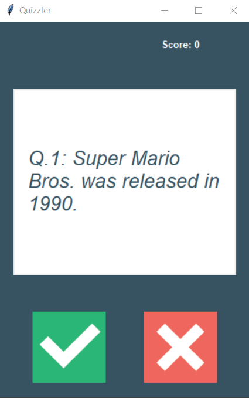

# Quizz Brain App

On the _main_ branch you can find the quizz application with GUI in which you 
choose if the given statement/information is True or False by clicking a proper button. 

## Questions

Questions are imported from Trivia question database - www.opentdb.com. 
In the current version there is no possibility of choosing neither the category nor
the level of difficulty. The number of imported questions can be changed in data.py file by changing the constant AMOUNT. 

## The gameplay
After starting the program you should see a window with a first question loaded, see below.

    

In order to choose the answer, click green (tick) for True or red (cross) for False.
If you answered correctly, the white canvas will change its color for green for one second, or red if the answer was incorrect.
During that time, before next question is loaded, both buttons are inactive.

    
    

The current score is displayed in the right upper corner of the window. 
When you finish the batch of the questions, proper message is displayed in the window.

    

Have fun!

PS: 

On the _multiple_ branch you can find another version of the quiz in
the text mode with multiple choices questions. The database is currently
limited to 3 categories with different difficulty levels 50 questions each. The user is typing in an
answer (spelling matters!) or a number of the answer.
In the future version the GUI will be added.  